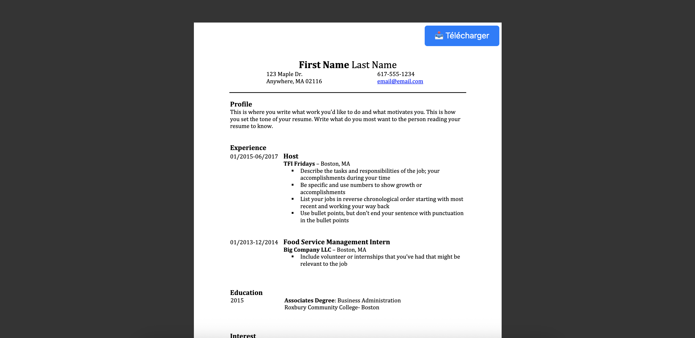

# APP Web Cv PDF

[](LICENSE)

Here is my app allowing me to easily share my CV as a link.   

## Description  

An application developed with React that allows you to display a PDF reader, in this case my CV, as well as a clickable button to allow simplified downloading of my CV  



## Table of Contents

- [Getting Started](#Getting-Started)
- [Add Your CV](#add-your-cv)
- [Launch Application](#Launch-Application)
- [Contributing](#Contributing)
- [License](#License)  

## Getting Started    

```bash
git clone https://github.com/HaDock404/app-web-cv_pdf.git
cd app-web-cv_pdf
npm install
``` 

## Add Your CV   

Before launching the application, copy your cv.pdf file (your CV) to the public folder at the project root.
The application will automatically detect this file and display it in the PDF reader and the download button.  

## Launch Application    

```bash
npm start
```  

## Contributing

Pull requests are welcome. For major changes, please open an issue first
to discuss what you would like to change.

Please make sure to update tests as appropriate.

## License  

This project is licensed under the MIT License - see the [LICENSE](./LICENSE) file for details.